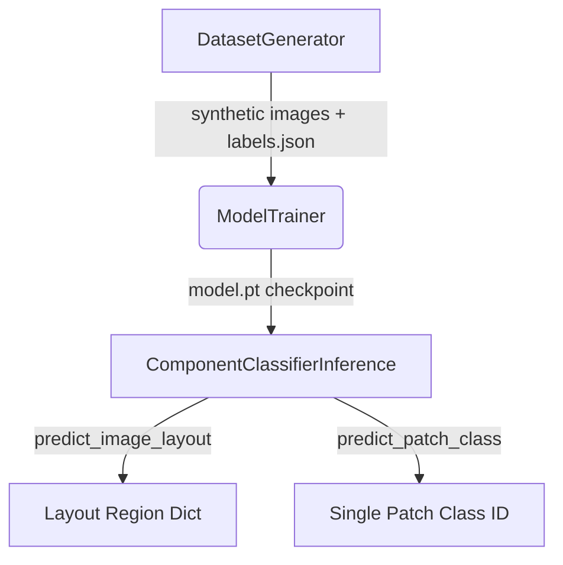

<p align="center">
  
</p>

<h1 align="center">WebGenAI</h1>

<p align="center">
  <strong>Generates optimized web components using neural networks.</strong>
</p>

<p align="center">
  <a href="https://github.com/Lumi-node/webgenai"></a>
  <a href="https://github.com/Lumi-node/webgenai"></a>
  <a href="https://github.com/Lumi-node/webgenai"></a>
</p>

---

WebGenAI is a proof-of-concept framework designed to bridge the gap between high-level design concepts and functional, optimized web components through the application of neural networks. It aims to automate the complex process of translating visual or structural inputs into production-ready code artifacts.

This project explores the feasibility of using advanced machine learning models to accelerate front-end development workflows, providing a foundation for future, more robust design-to-code solutions.

---

## Quick Start

```bash
# Install from source
git clone https://github.com/Lumi-node/webgenai.git
cd webgenai
pip install .

# Or install with dev dependencies
pip install ".[dev]"
```

### Generate a synthetic dataset and train a model

```python
from ane_design_model.dataset_generator import DatasetGenerator
from ane_design_model.model_trainer import ModelTrainer

# 1. Generate synthetic design mockups with ground-truth labels
generator = DatasetGenerator(seed=42)
labels = generator.generate_dataset(count=50, output_dir="./dataset")

# 2. Train the CNN+MLP classifier on the generated dataset
trainer = ModelTrainer(batch_size=16, epochs=10, learning_rate=0.001)
metrics = trainer.train(dataset_dir="./dataset", output_path="./model.pt")
print(f"Val accuracy: {metrics['val_accuracy']:.2%}")
```

### Run inference on a design image

```python
import numpy as np
from ane_design_model.inference import ComponentClassifierInference

# Load a trained model checkpoint
engine = ComponentClassifierInference(model_path="./model.pt")

# Classify a full design image into layout regions
image = np.random.randint(0, 255, (600, 800, 3), dtype=np.uint8)  # or load a real PNG
layout = engine.predict_image_layout(image)
# Returns: {"header": {"x":..., "y":..., "width":..., "height":...}, "sidebar": ..., "content": ..., "footer": ...}

# Classify a single 128x128 patch
patch = np.random.randint(0, 255, (128, 128, 3), dtype=np.uint8)
class_id = engine.predict_patch_class(patch)  # 0=header, 1=nav, 2=card, 3=footer
```

### CLI tools

```bash
# Generate a synthetic dataset
python -m ane_design_model.dataset_generator --count 50 --output ./dataset --seed 42
```

> **Note:** The `benchmark` and `ml_layout_detector` modules depend on an external
> `layout_detector` heuristic module bundled under `sources/`. These are functional
> but intended as internal comparison tools rather than public API.

## Architecture

The package is a patch-based CNN+MLP classifier that divides design mockup images into 128x128 pixel patches and classifies each patch as one of four layout regions: **header**, **nav** (sidebar), **card** (content), or **footer**. Region boundaries are reconstructed by computing bounding boxes over the classified patch grid.

The pipeline flows from **Dataset Generation** (synthetic mockups with brightness-based ground truth) to **Model Training** (supervised CNN+MLP on patch labels) to **Inference** (patch classification and layout reconstruction).



## API Reference

### `ane_design_model.model.ComponentClassifier`
CNN+MLP neural network for patch-based component classification (PyTorch `nn.Module`).
- **Input:** `(batch, 3, 128, 128)` float32 tensor in [0, 1]
- **Output:** `(batch, 4)` float32 logits (header, nav, card, footer)

### `ane_design_model.model.create_model() -> ComponentClassifier`
Factory function that returns a new `ComponentClassifier` instance.

### `ane_design_model.inference.ComponentClassifierInference`
Inference engine that loads a trained checkpoint and performs classification.
- `__init__(model_path: str, device: str | None = None)` -- loads checkpoint, auto-detects device
- `predict_patch_class(patch: np.ndarray) -> int` -- classifies a single `(128, 128, 3)` uint8 patch, returns class ID (0-3)
- `predict_batch(patches: torch.Tensor) -> torch.Tensor` -- classifies a batch `(N, 3, 128, 128)` float32 tensor, returns `(N, 4)` logits
- `predict_image_layout(image: np.ndarray) -> dict` -- classifies a full `(H, W, 3)` uint8 image, returns `{"header": ..., "sidebar": ..., "content": ..., "footer": ...}`

### `ane_design_model.dataset_generator.DatasetGenerator`
Generates synthetic design mockups with ground-truth component labels.
- `__init__(seed: int = 42)`
- `generate_synthetic_image(index: int) -> np.ndarray` -- returns a `(300, 400, 3)` uint8 RGB image
- `generate_dataset(count: int, output_dir: str) -> LabelsDict` -- saves PNG images and `labels.json`

### `ane_design_model.model_trainer.ModelTrainer`
Trains the `ComponentClassifier` on a synthetic dataset.
- `__init__(batch_size=16, epochs=10, learning_rate=0.001, device=None)`
- `train(dataset_dir: str, output_path: str, verbose: bool = True) -> dict` -- trains and saves checkpoint; returns `{"train_loss": float, "val_accuracy": float, "epochs_trained": int}`

### `ane_design_model` (package constants and utilities)
- `COMPONENT_CLASSES` -- `{"header": 0, "nav": 1, "card": 2, "footer": 3}`
- `get_component_class(region_name: str) -> int` -- maps region name (with aliases like "sidebar", "content") to class ID
- `get_region_name(class_id: int) -> str` -- maps class ID back to canonical name

## Research Background

This project explores neural layout detection as an alternative to brightness-heuristic approaches for design-to-code conversion. The CNN+MLP architecture operates on fixed 128x128 patches, trading global context for simplicity and speed. On Apple Silicon, the inference path optionally accelerates via the Apple Neural Engine (ANE) when available.

## Testing

The project includes 10 test files covering unit tests, integration tests, and cross-module integration for the full pipeline (dataset generation, model training, inference, ML layout detection, and benchmarking). Run with:

```bash
pytest tests/
```

## Contributing

Contributions are welcome! Please review the [contribution guidelines](CONTRIBUTING.md) for submitting pull requests or reporting issues.

## License

MIT License -- see [LICENSE](LICENSE) for details.