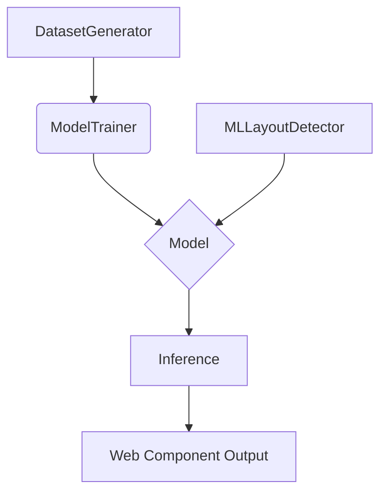

<p align="center">
  
</p>

<h1 align="center">WebGenAI</h1>

<p align="center">
  <strong>Generates optimized web components using neural networks.</strong>
</p>

<p align="center">
  <a href="https://github.com/Lumi-node/webgenai"></a>
  <a href="https://github.com/Lumi-node/webgenai"></a>
  <a href="https://github.com/Lumi-node/webgenai"></a>
</p>

---

WebGenAI is a proof-of-concept framework designed to bridge the gap between high-level design concepts and functional, optimized web components through the application of neural networks. It aims to automate the complex process of translating visual or structural inputs into production-ready code artifacts.

This project explores the feasibility of using advanced machine learning models to accelerate front-end development workflows, providing a foundation for future, more robust design-to-code solutions.

---

## Quick Start

```bash
pip install webgenai
```

```python
from ane_design_model.model import Model
from ane_design_model.inference import generate_component

# Initialize the model (assuming pre-trained weights are available)
model = Model()

# Generate a component based on a conceptual input structure
component_code = generate_component(input_data={"layout": "grid", "style": "modern"})
print(component_code)
```

## What Can You Do?

### Model Training and Benchmarking
Use the provided utilities to train and evaluate the underlying design model against synthetic datasets.

```python
from ane_design_model.model_trainer import train_model
from ane_design_model.benchmark import run_benchmark

# Train the model using a custom dataset generator
train_model(dataset_path="./synthetic_data")

# Run performance benchmarks
results = run_benchmark(model_instance)
print(results)
```

### Component Inference
Leverage the inference module to generate optimized web component code from abstract inputs.

```python
from ane_design_model.inference import generate_component

# Generate a component based on a specific prompt or configuration
output = generate_component(prompt="A responsive navigation bar")
print(output)
```

## Architecture

The architecture is centered around the `ane_design_model` package, which manages the entire lifecycle from data preparation to final code generation.

The flow generally moves from **Dataset Generation** $\rightarrow$ **Model Training** $\rightarrow$ **Inference**. The `ml_layout_detector` assists in parsing structural information, which feeds into the core `model.py`. The `model_trainer.py` handles optimization, while `inference.py` utilizes the trained `model.py` to produce the final output.



## API Reference

### `ane_design_model.model.Model`
The core neural network wrapper.
- `__init__()`: Initializes the model structure.
- `load_weights(path)`: Loads pre-trained weights.

### `ane_design_model.inference.generate_component(input_data)`
Generates the final web component code.
- **Parameters**: `input_data` (dict) - Configuration for the component.
- **Returns**: `str` - The generated HTML/CSS/JS code.

### `ane_design_model.model_trainer.train_model(dataset_path)`
Initiates the training loop.
- **Parameters**: `dataset_path` (str) - Path to the training data.

## Research Background

This project is inspired by the growing field of Neural Code Generation and Design-to-Code synthesis. It draws conceptual parallels from research in visual reasoning and automated UI generation, aiming to provide a practical, albeit early-stage, implementation of these concepts.

## Testing

The project includes 8 test files covering unit and integration tests for the model training pipeline, ensuring the core components function as expected.

## Contributing

Contributions are welcome! Please review the contribution guidelines for submitting pull requests or reporting issues.

## Citation

(No specific citations provided for this proof-of-concept.)

## License
The project is licensed under the MIT License - see the [LICENSE](LICENSE) file for details.