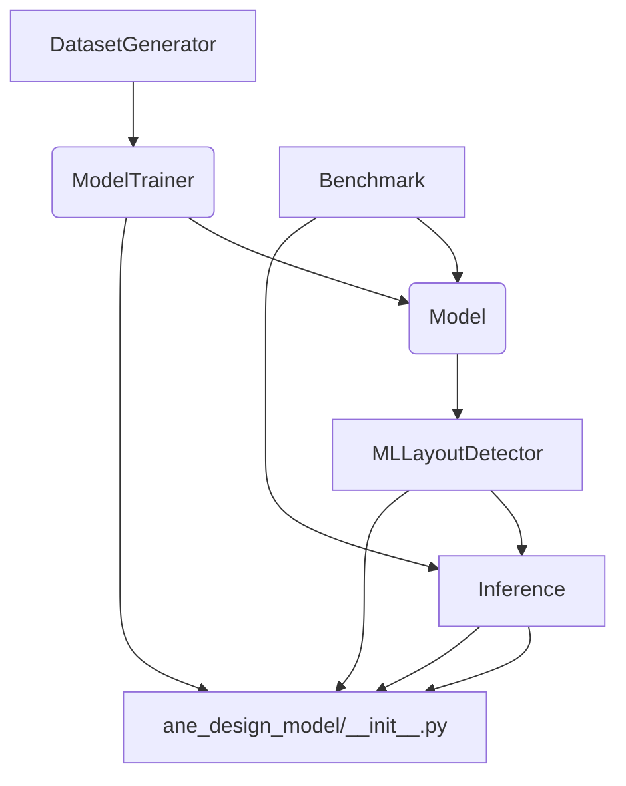

# Architecture: WebGenAI

WebGenAI is a sophisticated framework designed to automate and optimize the generation of web-based designs using advanced AI models. It integrates data generation, model training, layout detection, and inference into a cohesive pipeline. The architecture is modular, allowing for independent development, testing, and scaling of each core component, from data preparation to final design output.

## Module Relationships

The following diagram illustrates the dependencies and interactions between the core modules of the WebGenAI system.

## Module Descriptions

| Module | Path | Role |
| :--- | :--- | :--- |
| **Initialization** | `ane_design_model/__init__.py` | Serves as the main entry point and package initializer for the entire WebGenAI library, managing high-level imports and configuration. |
| **Model Core** | `ane_design_model/model.py` | Defines the core structure and architecture of the generative AI model. This module encapsulates the neural network definitions and forward/backward pass logic. |
| **Data Generation** | `ane_design_model/dataset_generator.py` | Responsible for creating synthetic or curated datasets required for training. It handles data loading, preprocessing, and augmentation specific to web design inputs. |
| **Model Training** | `ane_design_model/model_trainer.py` | Manages the entire training lifecycle. It takes data from `DatasetGenerator`, optimizes the `Model`, and saves trained weights. |
| **Layout Detection** | `ane_design_model/ml_layout_detector.py` | A specialized component that analyzes existing or generated designs to identify and extract structural layout information (e.g., component placement, grid structure). |
| **Inference Engine** | `ane_design_model/inference.py` | Handles the deployment and execution of the trained model. It takes new inputs and generates design outputs based on the learned patterns. |
| **Benchmarking** | `ane_design_model/benchmark.py` | Provides tools to evaluate the performance of the trained models. It runs standardized tests against datasets to measure accuracy, fidelity, and efficiency. |
| **Testing Suite** | `tests/` | Contains unit and integration tests (`unit_test_model_trainer.py`, `integration_test_model_trainer.py`) to ensure the robustness and correctness of the training and core logic components. |

## Data Flow Explanation

The WebGenAI pipeline follows a distinct flow, primarily divided into a **Training Phase** and an **Inference Phase**.

### 1. Training Phase (Learning)

1. **Data Acquisition:** The process begins with `dataset_generator.py`, which produces structured training data.
2. **Model Training:** This data is fed into `model_trainer.py`. The trainer iteratively feeds batches of data to the `model.py` instance, calculates the loss, and updates the model's weights using optimization algorithms.
3. **Evaluation:** Periodically, or upon completion, `benchmark.py` is utilized. It tests the current state of the `model.py` against a validation set to quantify its performance.
4. **Output:** The resulting optimized model weights are saved, ready for deployment.

### 2. Inference Phase (Generation)

1. **Input Processing:** A new design prompt or input is passed to the `inference.py` module.
2. **Layout Analysis (Optional/Pre-processing):** If the input is an existing design, `ml_layout_detector.py` analyzes it to extract structural metadata that can guide the generation process.
3. **Generation:** The `inference.py` module loads the trained `model.py` and executes the forward pass using the input data.
4. **Output:** The system generates the final web design artifact, which is managed and exposed through the main package interface (`__init__.py`).